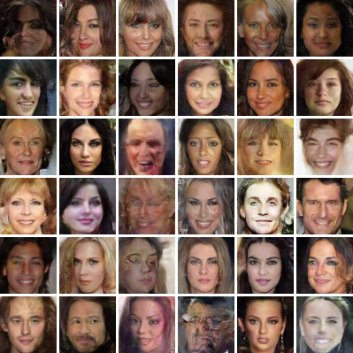
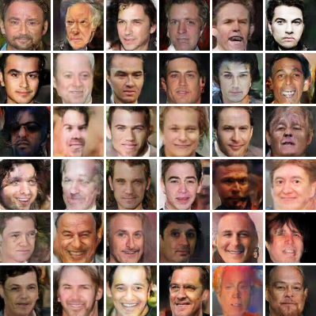
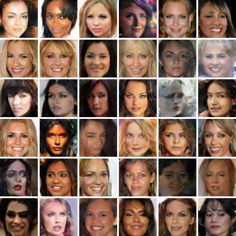
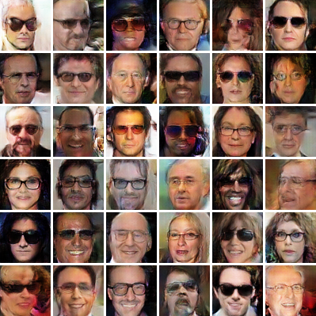
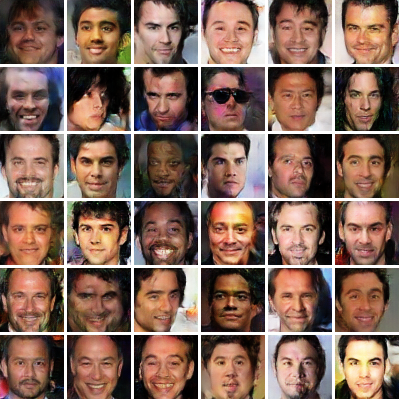
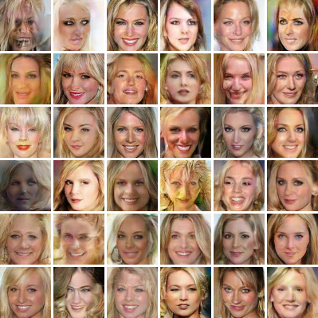

# Generating Faces with a DCGAN

## Necessary Libraries to run
* Python: Version 3.5
* Tensorflow: Version 1.14
* Open CV: Version 4.1.1
* Numpy
* Matplotlib

The versions of Numpy and Matplotlib shouldn't matter.

## Python files and explanations

`flags.py`: This python file defines all the parameters that are used in the neural network, this includes such things
as momentum, learning rate, batch size, epochs, etc.

`graph.py`: This is a python class that will load in a tensorflow model and store it independently from others. This
creates the opportunity to load in several models at the same time.

`load_attributes.py`: Loads types of images you want to generate. For example if you pass {'male': True} it will return only
the names of images that are males.

`load_images.py`: Loads in all real images and generates a random distribution that is sent to the generator network to create realistic images.

`models.py`: This file has the generator and discriminator models defined. There are comments on all of the dimensions.
The discriminator model uses conv2d with batch normalization and leaky relu, the generator model uses conv2d transpose
with batch normalization and leaky relu.

`save_results.py`: This file contains all the functions that convert the neural networks output back into a visible image,
and save it to view progress of training. Additionally, it contains the code to create a collage of images, and to save
the arrays of losses as plots.

`training.py`: This is where the actual training is done. The different tensors for each network are separated into their
own functions. The losses are also calculated. The loss for the discriminator is the loss of the real images added
with the loss of the fake images. And the generators loss is just a standard sigmoid_cross_entropy_with_logits. From
there models are trained until it reaches the designated epoch and then terminates. The model is also saved every
epoch.

# Results

## A few gifs showing the neural networks train over time

## Collage of final results

### Generated Faces on entrie dataset

### Male Generated Faces

### Female Generated Faces

### Generated Faces with glasses

### Black hair male generated faces

### Blonde hair female generated faces

